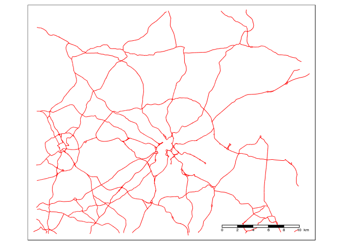
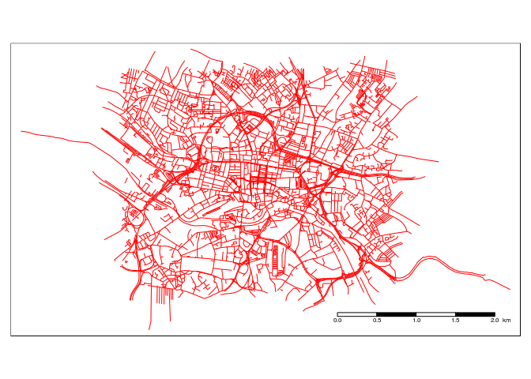

Filtering and segmenting roads
================
Robin Lovelace

<!-- README.md is generated from README.Rmd. Please edit that file -->
Context
-------

This project is motivated by a plan to create an online tool for crowdsoucing information about the cycle network. The policy problem it seeks to solve is that:

> Every city has a set of streets which could form a key cycle network. Such a network would form the basis of investment priorities by Local Authorities to make cycling easier and safer. Yet it is currently hard for local people to express the extent and form of this network in a coherent, consensus-driven way (CycleStreets.net, 2016).

The problem
-----------

The problem with a crowd-sourced system is that everyone wants to comment everywhere. This diversity is healthy but can make it hard to prioritise issues. Also for newcomers to cycle campaigning the complexity of options can be confusing.

So there is a need for a simpler unit of analysis linked to the transport network. This repository explores the creation of such a level of data: the segment.

The data problem
----------------

Here we illustrate the problem with reference to data from Ordance Survey and OpenStreetMap:

``` r
open_a_lds = geojson_read("data/open_a_lds.geojson", what = "sp")
qtm(open_a_lds) +
  tm_scale_bar()
```



``` r
summary(open_a_lds$length)
#>     Min.  1st Qu.   Median     Mean  3rd Qu.     Max. 
#>    0.024   27.120   51.120   93.790  100.000 3490.000
```

There is a wide range of distances in there. Most segments won't be of a size/shape of interest to people wanting to improve the road network. OSM data is also highly diverse in terms of lengths:

``` r
osm_highways_lds = geojson_read("data/highways-osm-leeds.geojson", what = "sp")
qtm(osm_highways_lds) +
  tm_scale_bar()
```



``` r
summary(gLength(osm_highways_lds, byid = T))
#>      Min.   1st Qu.    Median      Mean   3rd Qu.      Max. 
#>    0.2851   26.0900   53.7200   87.7600  109.7000 2656.0000
```
